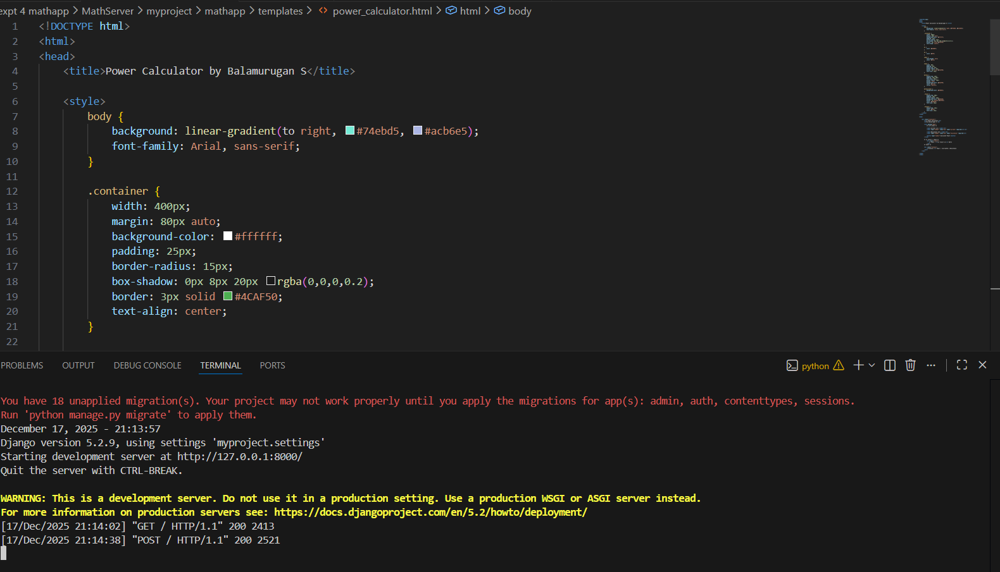
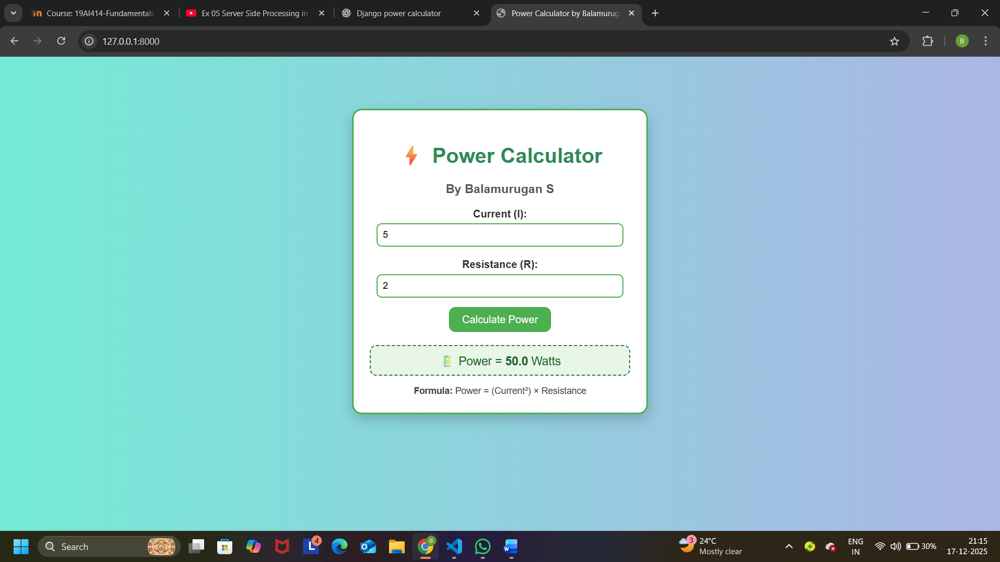

# Ex.04 Design a Website for Server Side Processing
## Date:17/12/2025

## AIM:
 To design a website to calculate the power of a lamp filament in an incandescent bulb in the server side. 


## FORMULA:
P = I<sup>2</sup>R
<br> P --> Power (in watts)
<br> I --> Intensity
<br> R --> Resistance

## DESIGN STEPS:

### Step 1:
Clone the repository from GitHub.

### Step 2:
Create Django Admin project.

### Step 3:
Create a New App under the Django Admin project.

### Step 4:
Create python programs for views and urls to perform server side processing.

### Step 5:
Create a HTML file to implement form based input and output.

### Step 6:
Publish the website in the given URL.

## PROGRAM :
power_calculator
```py
<!DOCTYPE html>
<html>
<head>
    <title>Power Calculator by Balamurugan S</title>

    <style>
        body {
            background: linear-gradient(to right, #74ebd5, #acb6e5);
            font-family: Arial, sans-serif;
        }

        .container {
            width: 400px;
            margin: 80px auto;
            background-color: #ffffff;
            padding: 25px;
            border-radius: 15px;
            box-shadow: 0px 8px 20px rgba(0,0,0,0.2);
            border: 3px solid #4CAF50;
            text-align: center;
        }

        h1 {
            color: #2E8B57;
        }

        h3 {
            color: #555;
        }

        label {
            font-weight: bold;
            color: #333;
        }

        input {
            width: 90%;
            padding: 8px;
            margin-top: 5px;
            border-radius: 8px;
            border: 2px solid #4CAF50;
            font-size: 14px;
        }

        button {
            margin-top: 15px;
            padding: 10px 20px;
            font-size: 16px;
            border-radius: 10px;
            border: none;
            background-color: #4CAF50;
            color: white;
            cursor: pointer;
        }

        button:hover {
            background-color: #388E3C;
        }

        .result {
            margin-top: 20px;
            padding: 10px;
            border-radius: 10px;
            background-color: #E8F5E9;
            border: 2px dashed #2E7D32;
            color: #1B5E20;
            font-size: 18px;
        }

        .formula {
            margin-top: 15px;
            color: #444;
            font-size: 14px;
        }
    </style>
</head>

<body>

    <div class="container">
        <h1>⚡ Power Calculator</h1>
        <h3>By Balamurugan S</h3>

        <form method="POST">
            

            <label>Current (I):</label><br>
            <input type="number" step="any" name="current" required><br><br>

            <label>Resistance (R):</label><br>
            <input type="number" step="any" name="resistance" required><br>

            <button type="submit">Calculate Power</button>
        </form>

        
            <div class="result">
                🔋 Power = <b>{{ result }}</b> Watts
            </div>
        

        <div class="formula">
            <b>Formula:</b> Power = (Current²) × Resistance
        </div>
    </div>

</body>
</html>
```
views.py
```
from django.shortcuts import render

def power_calculator(request):
    result = None
    if request.method == "POST":
        current = float(request.POST.get("current"))
        resistance = float(request.POST.get("resistance"))
        result = (current ** 2) * resistance

    return render(request, "power_calculator.html", {"result": result})
```
urls.py
```
from django.contrib import admin
from django.urls import path
from mathapp import views

urlpatterns = [
    path('admin/', admin.site.urls),
    path('',views.power_calculator,name="calculate_power"),
]
```

## SERVER SIDE PROCESSING:



## HOMEPAGE:



## RESULT:
The program for performing server side processing is completed successfully.
